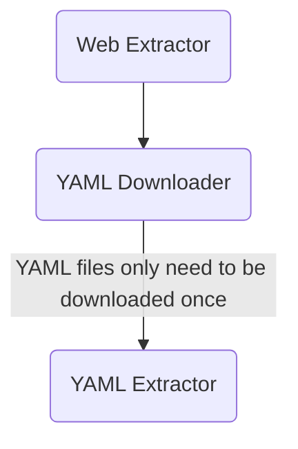

# Setup
1. Fork the repo and clone it locally.
2. Setup a Python virtual environment.
3. Install the dependencies documented in `REQUIREMENTS.txt`.

# Submitting a change
1. **Check that all tests pass with your change**, in addition to any newly introduced tests.
2. Add a description of your change to `CHANGELOG.md`.
3. Push your changes to your forked repo.
4. Create a pull request with your changes. You can also add yourself to the Contributors list in `README.md`.

# Architecture
The following diagram represents the logical dependencies of each library component, and how changes in one component can propagate to others:

# Repository Layout
With reference to the directory contents:
- `meaningless`: This is where library components live.
- `meaningless\utilities`: This is where shared logic between components is housed.
- `test`: This is where the unit tests live.
- `test\static`: This is where static files used by unit tests are found. Create a new subdirectory for each test file, except `unit_tests_yaml_file_interface.py`.
- `test\tmp`: This is a temporary folder for unit tests that modify the working directory in some way.
